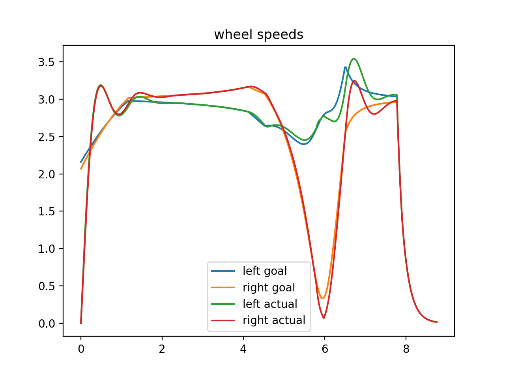
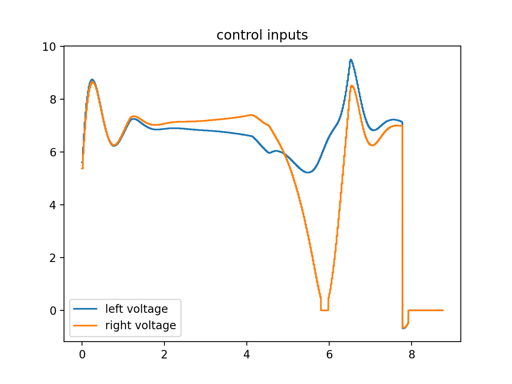

# differential-drivetrain-sim

## Overview

Simulation of trajectory following for a differential drivetrain including:
- Trajectory generator with linear and angular velocity constraints
- State space representation of differential drivetrain dynamics
- Field-relative odometry
- Simulated motor controller with velocity follower, ramp rate and deadband
- Ramsete global pose controller

## Example Trajectory

